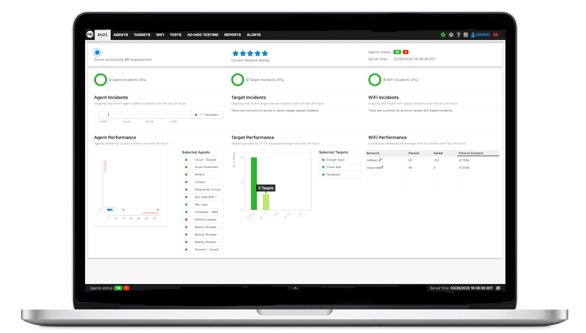

## Dashboard
The dashboard is the graphical user interface that is necessary to manage the agents, create monitoring tests, troubleshoot network or application problems, and receive alerts and reports.  The Dashboard runs on a dedicated server, called BeezKeeper. 

