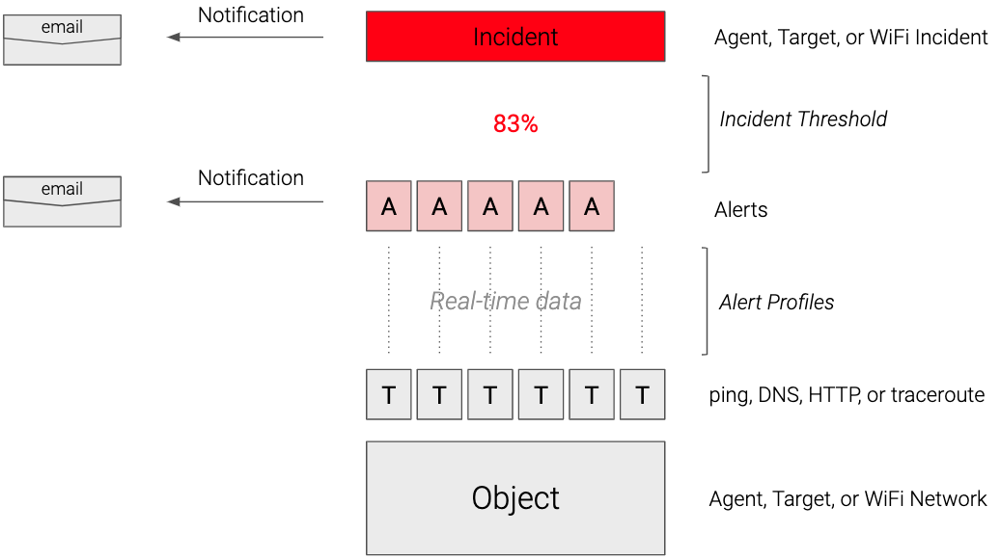
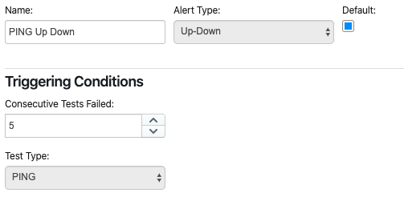
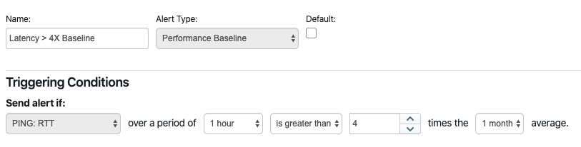
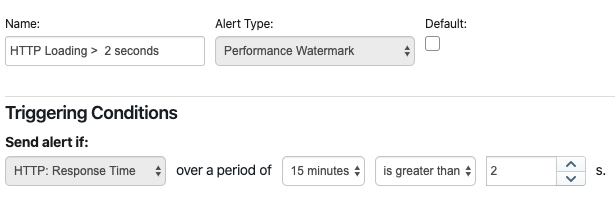
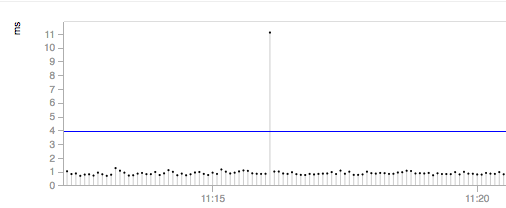
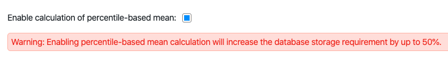
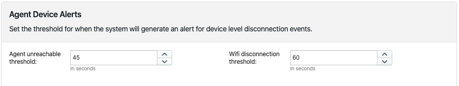
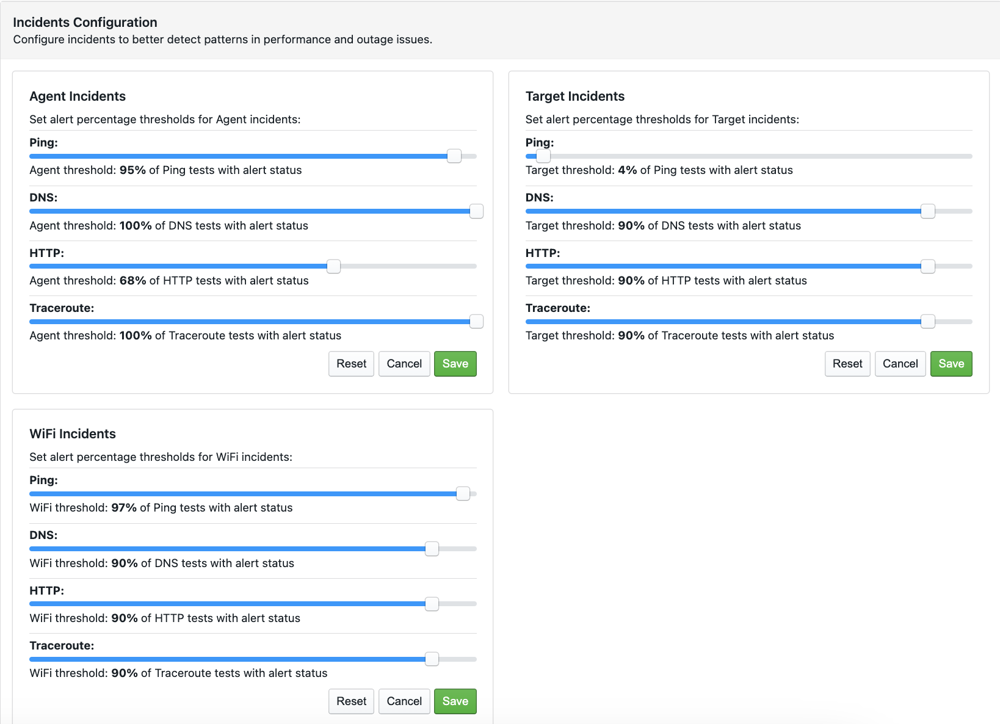
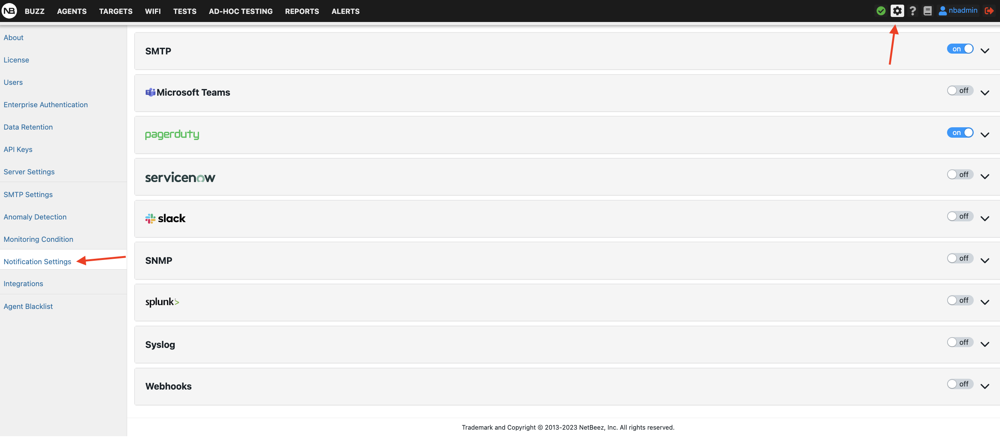

# Anomaly detection

Anomaly detection is one of the primary functionalities of NetBeez. Fast and proactive detection is possible thanks to the real-time testing performed by the agents in conjunction with the alert detection process running on the BeezKeeper server. NetBeez users should familiarize themselves with the key concepts that are covered in this section. 

There are three main components of the NetBeez anomaly detection system:

- **Alerts** - Alerts are triggered by real-time tests based on certain conditions, as defined in alert detectors; alert detectors are assigned to targets.
    
- **Incidents** - Incidents are triggered by an agent, target, or WiFi network when a certain percentage of tests trigger alerts (incident threshold); incidents are a good way to reduce the noise from multiple alerts related to the same resource.
    
- **Notifications** - Notifications are delivered via email, Slack, SNMP traps, and other methods when an alert is triggered and/or an incident is raised.
    

If the above chart is not clear, keep reading. In the next paragraphs, we’ll review in detail each one of these components.

- [Alert profiles](#alert-profiles)
	- [Types of alert profiles](#types-of-alert-profiles)
	- [Percentile-based mean](#percentile-based-mean)
- [Device alerts](#device-alerts)
- [Incidents](#incidents)
- [Notifications](#notifications)

## Alert profiles

Alert profiles are assigned to targets to detect problems such as loss of connectivity or performance degradation to a remote service or application. Alert profiles are test-specific, that is, are related to a specific type of test (ping, DNS, HTTP, traceroute, …). NetBeez offers default alert profiles, which can be edited or deleted. The user can create new alert profiles, and attach them to new or existing targets. Any change to an alert profile will be immediately pushed to all the targets where that profile has been enabled.

### Types of alert profiles

There are five types of alert profiles:

1. **Up-Down** - An up-down alert is triggered by a real-time test when it fails for a given number of consecutive tries. By default, the up-down multiplier is set to five. This value can be adjusted by the user at any time. 

	

	Up-down alerts are useful to detect loss of reachability to a remote host, network, or application.

2. **Performance Baseline** - A baseline alert is triggered by a real-time test when it detects a performance degradation issue. Performance degradation is detected by comparing the short-term moving average to its long-term, which is considered the performance baseline. In fact, for each test, the server calculates the following moving averages:
	
	1. Short-term: 1 minute, 15 minutes, 1 hour, 4 hours.
	2. Long-term: 1 day, 1 week, 1 month.
    
	If the short-term average of a test is a certain number of times higher than its long-term average, an alert is triggered. 
	

	This type of alert profile is suited when a target is applied to many agents that have different performance results against the same application, due to their geographical location or other factors.
	
3. **Performance Watermark** - Watermark alerts are triggered when a real-time test doesn’t meet specific performance requirements. These alerts are used to enforce service level agreements with network services and applications. Watermark alerts are configured by comparing a short-term average against a user-defined threshold (eg. packet loss is higher than 5% or DNS resolution time is higher than 100 ms).

	

4. **Performance Baseline AND Watermark** - This alert profile merges both performance baseline and watermark rules. If both detection methods are satisfied, then an alert will be triggered.
    
5. **Down-Up** - Down-up alerts are triggered when a test succeeds. The mechanism is the reciprocal of the up-down alert. Down-up alerts are used to enforce security policies, such as verifying content filtering (e.g. users can’t access certain websites) or firewall rules (e.g. an isolated network can’t access the Internet).
    
### Percentile-based mean

When calculating an average for a given time period, all test results are accounted for. However, especially in stable time series, one or a few outliers could dramatically skew the mathematical average, like in the below example. When this happens, performance alerts may be triggered, causing false positives.

NetBeez supports the use of a percentile-based mean (95th percentile), which filters out outliers that fall two times outside the standard deviation interval (from the mathematical average). The benefit of this function is that should a single data point skew the mathematical average, the percentile-based mean won't be affected, thus reducing the number of false positives (alerts noise). To enable this feature, the user can enable the use of a percentile-based mean in the Anomaly Detection settings section.

If you want to learn more about alert profiles and percentile-based mean, please refer to the [online documentation page](https://netbeez.zendesk.com/hc/en-us/articles/201580529-Alerts-Configuration).

## Device alerts

Device alerts are triggered when an agent is either unreachable from the dashboard, or a WiFi agent isn’t able to connect to a WiFi network for a given period of time.

One important thing to remember is that, when a device is not connected to the dashboard anymore, all tests are placed in unknown status (marked with “?”), incidents are cleared and so are alerts.

## Incidents

Incidents are periods of degraded or otherwise abnormal performance of an agent, target, or WiFi network. This functionality is designed to help users identify problems and performance variations with a network location (agent), service or application (target), and WiFi network. Another benefit of incidents is that they reduce the number of notifications that a user has to receive.

An incident is triggered when a certain percentage of tests within one agent, target, or WiFi network trigger an alert. Such thresholds are defined by the user in the NetBeez “Incidents Configuration” settings, under the “Anomaly Detection” section.

Incidents can be acknowledged, and users can post comments to include more information about the undergoing performance issue, or explain the reason why a specific incident was acknowledged or de-acknowledged.

If you want to read more about Incidents, please consult [this documentation page](https://netbeez.zendesk.com/hc/en-us/articles/115003579411-Incidents).
## Notifications

Even when not in front of the dashboard, users can receive notifications on alerts and incidents. NetBeez supports different delivery methods for notifying users about new alerts and incidents raised and closed, such as SNMP traps, Syslog messages, and emails. For each delivery method, the user can pick what to receive: alerts, aggregate alerts, incidents, or any combination of them. In general, it’s good practice to enable notifications for agent incidents and alerts, target incidents, and wifi incidents.

NetBeez also provides integrations with many third-party tools, such as Splunk, PagerDuty, ServiceNow, Microsoft Teams, webhooks and Slack. You can learn more about these integrations on the [online documentation](https://netbeez.zendesk.com/hc/en-us/sections/201825346-Integrations-and-API).