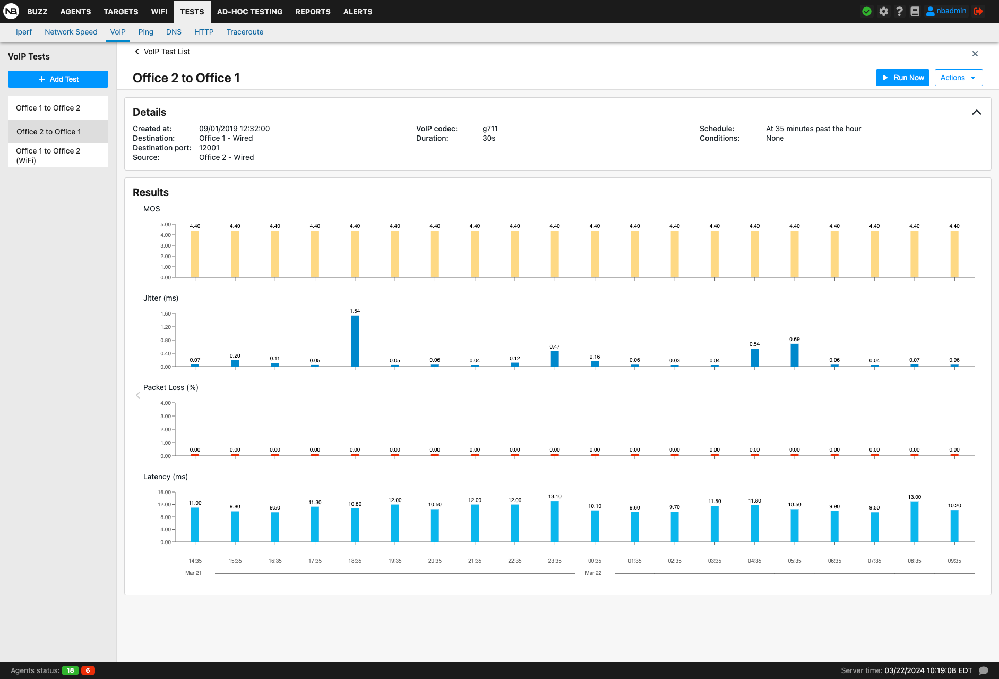

# Network monitoring
In this section, we’ll set up NetBeez to monitor in real-time some applications and run periodic network performance tests.

- [ISP Tagging](#isp-tagging)
- [Endpoint Performance Metrics](#endpoint-performance-metrics)
- [Targets and real-time testing](#targets-and-real-time-testing)
	- [Creating a target](#creating-a-target)
	- [Path Analysis](#path-analysis)
	- [Monitoring a web application](#monitoring-a-web-application)
	- [Monitoring a DNS service](#monitoring-a-dns-service)
	- [Monitoring a TCP-based application](#monitoring-a-tcp-based-application)
	- [WAN performance monitoring](#wan-performance-monitoring)
	- [Gateway Testing](#gateway-testing)
	- [Tests Over VPN](#tests-over-vpn)
- [Monitoring network performance with scheduled tests](#monitoring-network-performance-with-scheduled-tests)
	- [Iperf](#iperf)
	- [Network speed](#network-speed)
	- [VoIP](#voip)
- [QoS](#qos)

## ISP Tagging
When an agent connects to the NetBeez dashboard it reports its external IP address. With that information, the NetBeez dashboard then applies the following two tags to an agent:

- ISP name, which is the name of the internet service provider that the remote user connects to.
    
- Autonomous System Number (ASN), which is a specific network number that belongs to that specific ISP.
    
With ISP tagging NetBeez users can filter agents based on these two tags, and reduce troubleshooting time to identify ISP issues affecting a set of remote users.

Read more about ISP Tagging in our [documentation](https://netbeez.zendesk.com/hc/en-us/articles/4413138630797).
## Endpoint Performance Metrics
Device performance metrics are available on remote endpoints and network agents. On the agent details, you are able to view CPU, RAM, and HDD space. CPU and RAM data can be viewed on Ping, DNS, and HTTP tests' real-time and historical graphs. With this information, it will be easier to troubleshoot remote end-user experience issues caused by endpoint performance degradation.

Read more about endpoint metrics in our [documentation](https://netbeez.zendesk.com/hc/en-us/articles/4413138229005).
## Targets and real-time testing
To monitor an application you need to create a target using its FQDN, IP, or web address and select the tests that will be included. The tests are selected based on the type of application, or service, that is monitored. The minimum test interval can be set to one second to reduce the time to detect problems as well as to have enough granular data to understand the behavior of the network and applications (except for Path Analysis where the minimum interval is 60 seconds).  

Currently, NetBeez supports five types of real-time tests: Ping, DNS, HTTP, traceroute, and path analysis.

- **Ping** - Ping can be run as an ICMP echo request or as a TCP socket connection. The ICMP command supports extra parameters such as: Maximum Transmission Unit (MTU), Don’t Fragment (DF) bit, DSCP value. The TCP supports various connection parameters like SYN, ACK, FIN, PUSH, … Jitter and Mean Opinions Score (MOS) can be enabled on ping tests to help monitor online voice and video conferencing performance. Ping tests should have their interval be equal to 5 seconds or less.
    
- **DNS** - A DNS test executes a lookup for a given FQDN. This test is implemented with the dig command. The DNS supports the DNS server as an optional parameter. If left empty, each agent will use the assigned DNS server.
    
- **HTTP** - The HTTP test consists of a GET request, implemented with the command curl. The command supports both HTTP and HTTPS pages, custom URLs, requests via proxy servers (authenticated and non), basic and NTLM authentication for pages.
    
- **Traceroute** - Traceroute tests support the ICMP, TCP, and UDP protocols. This command supports extra parameters: Destination port number, max hops, timeouts per hop, and DSCP value.
    
- **Path Analysis** - Path Analysis augments the existing traceroute capability for more accurate, real-time visibility on equal-cost multi-path network topologies.  It is advised to add a ping and/or HTTP test for better analysis.
    
The real-time and historical graphs can be used to monitor ping, DNS, HTTP, and Traceroute tests. These graphs can be accessed through the agent details, target details, tests tab, and alerts tab. The real-time graph can be toggled to a historical graph by clicking the buttons in the lower right corner.

While on the historical view, ping, DNS, and HTTP can be exported to a CSV file and downloaded.

Path analysis results are found on the Path Analysis tab on the agent details page.

The below table reports the default timing intervals associated with tests included in a target. Test intervals can be adjusted anytime by the user.

|Test|Runs every (default)|
|---|---|
|Ping|5 seconds|
|DNS|30 seconds|
|HTTP|60 seconds|
|Traceroute|120 seconds|
|Path Analysis|300 seconds|

In the rest of this section, we’ll review some target templates that can be used to monitor specific applications.
### Creating a target
In the following sections, we’ll report some strategies that can be used to monitor web applications and network services in real-time. 

Targets can be created from predefined SaaS targets, target templates, and fully customizable targets.

- **SaaS Targets**: Predefined targets like Google, Zoom, Slack, and many more targets.
    
- **Target Templates**: Website, DNS, VPN, and Gateway.
    
- **Custom Targets**: Ping, DNS, HTTP, Traceroute, and Path Analysis.
    

Before creating a target, it’s a good practice to verify on the ad-hoc tab that the tests are correctly configured. Common configuration mistakes include:

- The monitored service doesn’t allow ping tests; if that’s the case, verify if it’s reachable via a TCP-based ping.
    
- The web URL specified in an HTTP test has a redirection or doesn’t allow access to authenticated users (consider configuring HTTP basic or NTLM authentication).
    
- The FQDN or DNS name is incorrect.
    
### Path Analysis
The Path Analysis feature augments the existing traceroute capability for more accurate, real-time visibility on equal-cost multi-path network topologies, such as the Internet.

For each hop, path analysis provides extensive information that is valuable for network analysis and troubleshooting, such as:

- IP address and reverse DNS (if available)
    
- Round-trip time (RTT) real-time and historical
    
- Color coding of the RTT value (orange if above 100 ms. and red if above 150 ms.)
    
- Autonomous System Number (ASN), and AS Name
    
- Geo-IP location with coordinates
    
The path analysis plot also enables the user to highlight hops based on RTT, IP, DNS, and ASN, making it easier to troubleshoot performance issues with specific nodes, as well as aggregating nodes based on ASN and DNS domains to better understand the high-level topology your users traverse to reach their destination.

Visit our [documentation](https://netbeez.zendesk.com/hc/en-us/articles/4403099027853-Path-Analysis) for more information on how to set up Path Analysis.
### Monitoring a web application
To monitor a web service include the following tests:

- **Ping** - Reports the round-trip time and packet loss to the server where the application is hosted; if ICMP is not allowed, the user can configure a TCP-based ping test to the remote host’s TCP port 80 or 443.
    
- **DNS** - Verifies that the web service’s FQDN is working and the end-user clients can resolve the FQDN associated with the application. 
    
- **HTTP** - Performs an HTTP(S) GET to the URL provided in the address, verifying that the service is available to the users.
    
By comparing the status and performance of these three tests from multiple agents, NetBeez can determine whether a problem is related to the network, the webserver, or the DNS. In the [anomaly detection](https://docs.google.com/document/d/1GsIWkWI3mMj2xqG0Ce_1BNrb8t8RhePK_bokT24sjo4/edit#heading=h.n6ogakcoekwr) section of this manual, we’ll cover in detail alerts, incidents, and notifications.

### Monitoring a DNS service
When monitoring a DNS server we want to make sure that those DNS servers are reachable by the end-users and that the DNS service on the servers is correctly working (responding to DNS requests). For this reason, we’ll create the following resources:

- One resource for each DNS server to be monitored; set the DNS server’s IP address as destination, and include ping and traceroute or path analysis tests.
    

- One resource (or more if needed) to verify that the DNS resolution process is working; set as destination one FQDN, then create a DNS test for each one of the DNS servers to be monitored. In the DNS test settings, specify the IP address of the DNS server
    

### Monitoring a TCP-based application
Other applications can be monitored using a TCP-based ping test, which verifies that a specific TCP/IP port is open and how long it takes to establish a connection. This test, complemented with ICMP-based ping provides good data to verify the status and health of a generic TCP-based application.

### WAN performance monitoring
To monitor the performance of a Wide Area Network, users can set up a hub-and-spoke or a full-mesh target. A hub-and-spoke target is used to verify connectivity and performance from remote sites to one or more WAN routers (aggregation points). A full-mesh target is used to verify connectivity and performance from each remote site to another remote site. The former is easier to set up and requires fewer tests than the latter. The latter is more complete because it takes into account the source and the destination. Users should consider the pros and cons of each solution before picking one.

To set up a hub-and-spoke target, create one resource for each WAN router, using the WAN router’s loopback IP as a destination, and select ping and traceroute tests. As an alternative to the router’s loopback, a dedicated hardware or software sensor connected to a WAN router can be used as a destination. Lastly, include the agents that are located at the remote WAN locations as monitoring endpoints.

In a full-mesh target, create one resource for each agent deployed at a WAN site, include ping and traceroute tests, and select all WAN agents as monitoring endpoints. Please keep in mind that in a full-mesh target with N locations, N * ( N - 1 ) ping and traceroute tests will be created. In the case of a large N, users may want to reduce the test interval to reduce the test traffic on the network.
### Gateway Testing
Gateway testing gives the ability to define a generic ‘_gateway_’ target that the agent translates locally to its default gateway. The remote worker agents test the wired gateway if it is connected via Ethernet, otherwise, they test the wireless gateway if it is connected via WiFi. The network agents can test both wired and wireless gateways simultaneously depending on how the target is configured.

Only ping tests can be added to targets using gateway testing; DNS, HTTP, Traceroute, and Path Analysis are disabled.

You can review setting up gateway testing on [this documentation page](https://netbeez.zendesk.com/hc/en-us/articles/6193893295757).
### Tests Over VPN
Targets can be configured to run tests only when the VPN interface on assigned agents is connected. This helps eliminate false positive alerts in NetBeez when performing tests that only exist while connected to a VPN.

For agents that do not have a VPN interface and are assigned to a target running tests on VPN, no tests will be run until the endpoint detects a VPN interface. Currently, only remote worker agents support testing over VPN.

You can review setting up tests over VPN on [this documentation page](https://netbeez.zendesk.com/hc/en-us/articles/5383378574349). 
## Monitoring network performance with scheduled tests
NetBeez supports three types of scheduled tests: Iperf, network speed, and VoIP. The goal of scheduled tests is to build a baseline for network performance on download, upload, and call quality. The schedule is user-defined and periodic: it can be hourly, daily, weekly, or custom, running on specific hours throughout the day or certain days in a week or month.
### Iperf
NetBeez has implemented an automated way to run Iperf throughput tests without needing an operator to do so. For those unfamiliar with iperf, it’s an open-source utility that executes TCP, UDP, and multicast throughput tests between one or more end-points. An Iperf test returns the one-way throughput between the client(s) and the server. In the case of UDP tests, Iperf also reports packet loss and jitter. Iperf can be also configured to run multiple parallel tests, stress testing the network.

NetBeez supports two patterns: from one agent to another one, or from one or more agents to an Iperf server, which is not managed by the NetBeez dashboard itself. This case is useful to stress test a hub-and-spoke topology.

Another important option is the reverse flag. With this option, the throughput test can originate from the server to the client. This configuration is particularly useful when the client is behind a NAT device and there are no other ways to verify throughput.
#### Enhanced Scheduled Test Result Visualization For Iperf Tests
An enhanced user interface has been added to multiple agents to server Iperf test results. Agents can be filtered by name, agent groups, agent type, ISP, ASN, bandwidth, jitter (UDP Only), and packet loss (UDP Only). Clicking on an agent in the table will display the agent's historical data in the next section. 

In the section 'Draw Graph Based On': if bandwidth, jitter, and packet loss are selected, there will be a checkbox with the option to transform the graph into 3d. Viewing 3d Iperf test results is only available for UDP Iperf tests.

You can review setting Iperf tests on [this documentation page](https://netbeez.zendesk.com/hc/en-us/articles/201614383-Iperf).
### Network speed
Network speed tests are useful to measure and build a baseline of download and upload speed. This data can be used to enforce Service Level Agreements (SLAs) with Internet Service Providers (ISPs) or troubleshoot performance issues at remote sites. 

NetBeez agents can run three different implementations of network speed tests:

- Speedtest - NetBeez is using speedtest-cli, the open-source implementation of the Ookla speed test service. The GitHub page of the speedtest-cli project is available at [https://github.com/sivel/speedtest-cli](https://github.com/sivel/speedtest-cli). This test measures the download, upload speed, and latency to an Internet Ookla speed test server. The user can select one specific speed test server from a public list or to let the algorithm pick the server with the lowest latency.
    
- NDT - NDT is an open-source speed test service promoted by the [M-Lab consortium](https://www.measurementlab.net/about/). Like the Ookla speed test service, NDT reports download, upload speed, and latency. NDT is also available via the command-line interface and reports additional information on the link between the NDT client, the NetBeez agent, and the NDT server, such as:
    
- slowest link speed traversed by the packets,
    
- whether there are network firewalls,
    
- whether the client or the server is behind NAT.
    
If you want to learn more about this command, read the [blog post on NDT](https://netbeez.net/blog/measuring-internet-speed-via-ndt/) that we wrote.

- Fast.com - This is a download speed only test to the NetFlix CDN network to verify the performance of NetFlix streaming. This feature is particularly useful to Internet Service Providers interested in measuring the home subscriber end-user experience.
    
#### Enhanced Scheduled Test Result Visualization For Network Speed Tests
Network Speed test results optimizes the user interface when viewing scheduled test results for hundreds or thousands of agents making it easy to filter and search for specific agent results. All network speed test results utilize this enhanced feature.

### VoIP
VoIP tests are used to assess the quality of the network to deliver real-time, voice calls. VoIP calls require a low latency network, with zero or minimal packet loss and jitter (variation of latency). 

The test simulates a VoIP call between two agents and returns the Mean Opinion Score ([MOS](https://netbeez.net/blog/impact-of-packet-loss-jitter-and-latency-on-voip/)), which is a key performance indicator of call quality. The test also reports the jitter, packet loss, and latency values, which are factors that affect the call quality and, consequently the MOS calculation. If you want to learn more about this, read our [blog post on MOS](https://netbeez.net/blog/what-you-should-know-about-voice-over-ip/).

When creating a new VoIP test, the user can pick the codec that is used to run the test. Please refer to the table below for a list of codecs and their characteristics. All the VoIP tests generate a UDP stream between the two agents selected that conform to the codec’s specifications. A common characteristic of these different codecs is that they’re delivered as UDP packets marked with the EF (DSCP 46) IP Type of Service.

|Codec Name|Payload Size|Voice Speech|Pkts per Sec.|Bit Rate|
|---|---|---|---|---|
|G.711|160 Bytes|20 ms|50|64 Kbps|
|G.729|20 Bytes|20 ms|50|8 Kbps|
|G.723.1-63|24 Bytes|30 ms|33.3|21.9 Kbps|
|G.723.1-53|20 Bytes|30 ms|33.3|20.8 Kbps|
|G.726|80 Bytes|20 ms|50|55.2 Kbps|
|G.728|60 Bytes|30 ms|33.3|31.5 Kbps|
|G.722|160 Bytes|20 ms|50|38.4 Kbps|

## QoS

NetBeez has included DSCP marking of IP packets in the following tests: ping, traceroute, Iperf, and VoIP (pre-set). DSCP marking can be used to test differences in test performance based on the QoS policy applied to network devices.