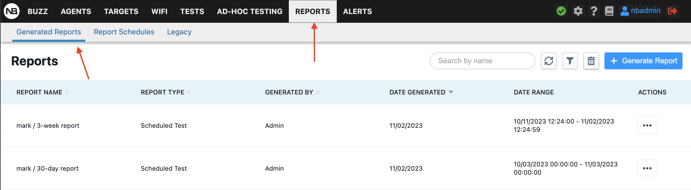
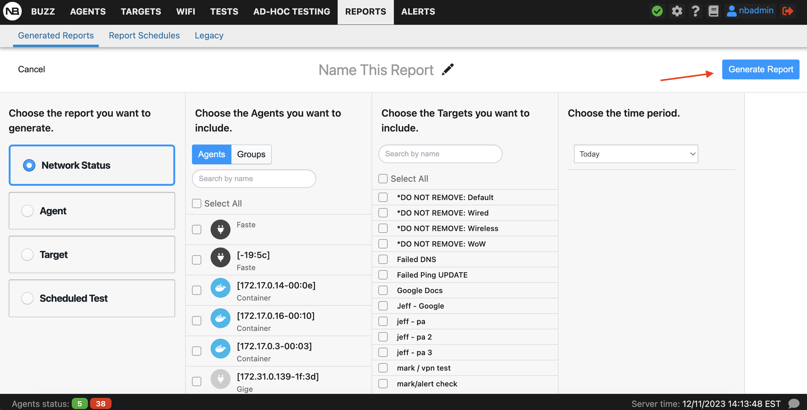
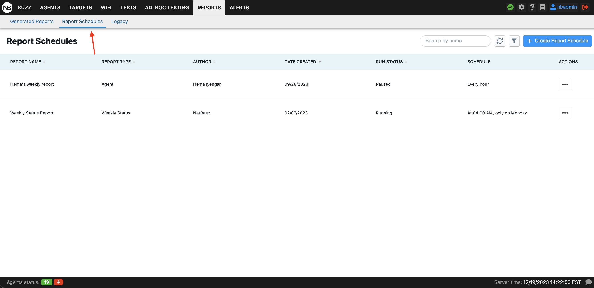
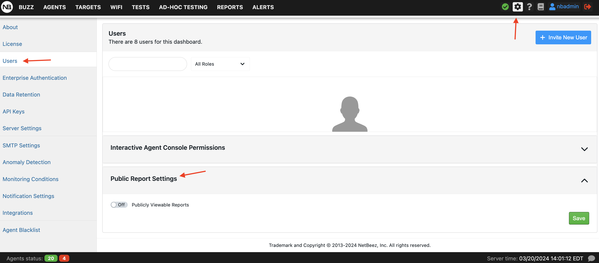
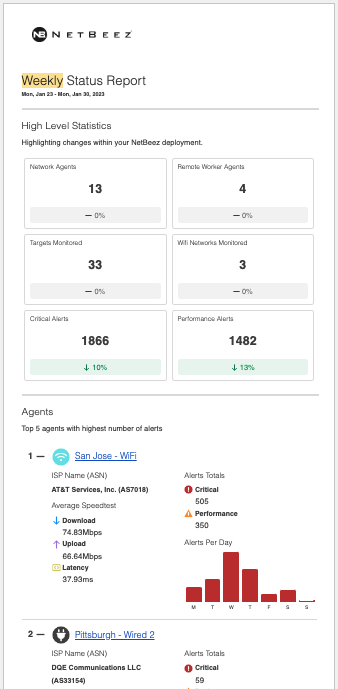

# Reports and API

NetBeez users can generate reports to review historical network and application performance data based on agents deployed, targets, and scheduled tests configured. Reports can be generated on the dashboard or can be scheduled to be sent via email. 

- [Legacy Reports](<#legacy reports>)
- [Generated Reports](<#generated reports>)
- [Report Schedules](<#report schedules>)
- [Email reports](<#email reports>)
- [Weekly Reports](<#weekly reports>)
- [API](#api)
	- [Public dashboard](<#public dashboard>)
## Legacy Reports

In the Legacy Reports section under the Reports tab is located the legacy reporting feature. Starting from version 5.0, the NetBeez dashboard is offering an improved and more efficient reporting experience. Until the Reports Beta is completed, the original reporting feature can be utilized under the Legacy Reports tab. Four types of reports can be generated under Legacy Reports:

- **Network summary** - This report provides a high-level overview of agents and targets. For each agent, the user can review availability, download, and upload speed if that agent had a speed test configured, and the number of alerts. For each target, the user can review the average HTTP GET time and number of alerts.
- **Agents** - The user can select one or more agents to get a report on alerts occurrence per target monitored, test performance, and HTTP targets performance.
- **Targets** - The user can select one or more targets to get a report on alerts occurrence per agent included, test performance, and HTTP performance per agent.
- **Scheduled tests** - This report plots in a line graph format selected Iperf, speed test, and VoIP scheduled tests.

When generating a report on the dashboard, it’s possible to extract such a report in PDF format or save that report in a preset, which is the definition of the report type along with the input parameters selected (e.g. report time period, elements to be included in the report, etc.). As we’ll see in the next paragraph, presets must be created to schedule email reports.

## Generated Reports

The new reports experience is in beta so the functionality currently is limited. For this reason, the fully functional reports are available under the "Legacy Reports” subtab. The redesign makes generating reports easier and more intuitive. As of version 8.0, network status reports and agent reports can be generated Future releases will include targets and scheduled test reports. Please be aware that in the current version there is no email functionality or PDF download option. The Legacy Reporting tab will remain for these needs until the new Reports Beta is completed.

## Report Schedules

NetBeez users can configure reports to be generated at set schedules (cron style) and emails will be sent out to a list of specified emails. The sent emails include a link that can be followed by anyone who has it regardless of whether they have a NetBeez account or not.

The public access of reports can be turned on and off by the administrator at any time under Settings > Users.

## Email reports

NetBeez users can send PDF reports via email. The reports that are included in the email are defined via presets. Emails are sent to one or more email addresses based on a user-defined schedule. To learn more about email reports, please consult [this documentation page](https://netbeez.zendesk.com/hc/en-us/articles/115003340066-Email-Reports).

## Weekly Reports

A weekly status report will be emailed to all users of the dashboard every week. Each report provides insight into your agents, targets, and WiFi Networks by highlighting the 5 least performing in each category. Get detailed information on factors like number of alerts for agents, time in incidents for targets, and failed connection attempts for WiFi networks. These reports will be sent straight to your inbox every Monday. If you'd like to opt-out, simply send us a message and we'll take care of it for you. Opt-out toggle coming soon on the dashboard. Read more about weekly reports in our [documentation](https://netbeez.zendesk.com/hc/en-us/articles/13074584292877-Weekly-Reports).

## API

NetBeez has a public API, which can be reviewed on the swagger page available with each instance at the URL https://<DASHBOARD_FQDN>/swagger/index.html. The current version of the API makes it possible for external applications to get the object’s status, network, and application performance data collected by the agents.

### Public dashboard

The public dashboard is an open-source project developed in PHP and uses the NetBeez public API. The public dashboard can be installed on any web-server (libcurl required) to provide a service status dashboard based on the targets and agents configured. The benefits of a public dashboard are that the network engineers and managers can share the status of the network and applications monitoring with the end-users by NetBeez. Also, the public dashboard can be installed on an intranet or public website, without compromising the NetBeez server’s security. If you want to learn more about this, check out the [public dashboard GitHub page](https://github.com/netbeez/public-dashboard).
