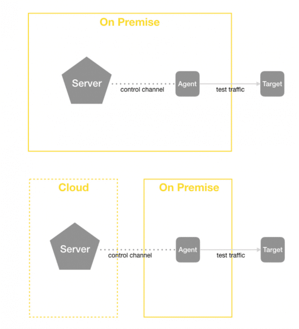

# Server Deployment

- [On-premises or cloud](#on-premise-or-cloud)
- [Firewall rules](#firewall-rules)
	- [Server](#server)
	- [Agents](#agents)
- [Dashboard activation](#dashboard-activation)

## On-premises or cloud

The user has the option to run the BeezKeeper server on-premises or in the cloud. 

An on-premise server requires a virtualization environment. The BeezKeeper is delivered as a pre-configured appliance that includes the operating system and the NetBeez software. The IP settings are provided by the customer, who’s required to install a DNS entry associated with the BeezKeeper’s FQDN.

Cloud installations are performed on the customer’s cloud account. NetBeez will share privately the server’s AMI (in the case of AWS). Installations on other public cloud providers are run on an Ubuntu server.

## Firewall rules

Firewall rules are needed to permit the agents to connect to the server and the server to download software updates from the public NetBeez repository. The BeezKeeper also supports software updates via an HTTP proxy if the network firewalls deny outbound access.

### Server

The BeezKeeper requires the following firewall rules to access NetBeez software repository:

- Outbound access to TCP port 80 to any host
    
- Outbound access to TCP port 443 to any host
    

These rules can’t be limited to a specific host because the IP address of the NetBeez software repository often changes. If the above requirements are too relaxed, consider using an HTTP proxy server. To enable this option, please contact support.

### Agents

The agents require connectivity to the BeezKeeper to establish the control channel and download the latest software update when available. Below are two firewall rules that must be applied to the network in the presence of firewalls:

- Outbound access to TCP port 443 to the BeezKeeper’s IP address for the software update
    
- Outbound access to TCP port 20018 to the BeezKeeper’s IP address for the control channel
    

Please remember that Docker and Linux agents are updated using the regular update process for Linux packages and Docker containers.

## Dashboard activation

Once the BeezKeeper and the Beez have been deployed, it’s time to point your browser to the NetBeez dashboard to access the [first-run wizard](https://netbeez.zendesk.com/hc/en-us/articles/204590039-Setting-Up-NetBeez-First-Run). During the first-run wizard, you will be able to:

- Create an administrator account
    
- Select predefined SaaS targets to be added to the dashboard
    
- Create custom targets to be added to the dashboard (like website, DNS services, VPN targets, and local gateway targets )
    
- Invite dashboard users (admin, read/write, and read-only)
    
- Send remote worker endpoints to users
    

